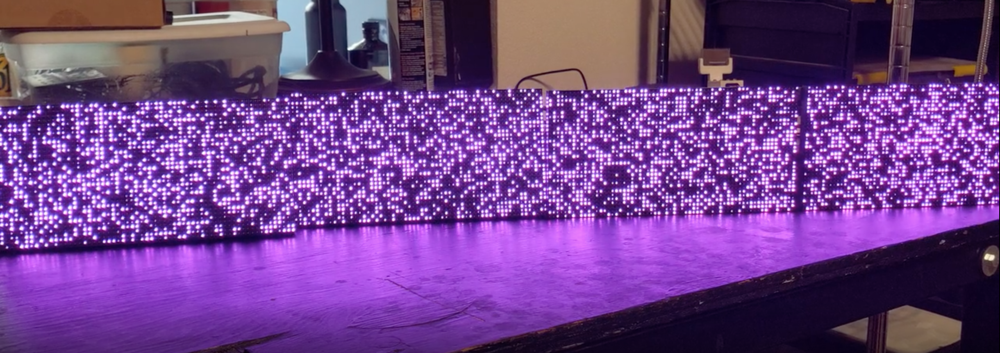

# Raspberry Pi LED Matrix

Control an RGB LED matrix connected to a Raspberry Pi using using Node.js. This library is a Node/Typescript binding of the brilliant [hzeller/rpi-rgb-led-matrix](https://github.com/hzeller/rpi-rgb-led-matrix) library, plus some additional functionality. Builds on some of the mechanisms implemented by [easybotics/node-rpi-rgb-led-matrix](https://github.com/easybotics/node-rpi-rgb-led-matrix) for double-buffering bitframes to get silky-smooth rendering.

- [Features](#features)
- [Installation and Usage](#installation-and-usage)
- [Getting Started](#getting-started)
  * [The bare minimum](#the-bare-minimum)
- [Configuration Options](#configuration)
  * [Matrix options](#matrix-options)
  * [Runtime options](#runtime-options)
- [Drawing](#drawing)
  * [Usage Patterns](#usage-patterns)
  * [Sync Hook](#sync-hook)
- [Running /examples](#running--examples)
    + [Using your own config](#using-your-own-config)
- [API](#api)
    + [Configuration option enums](#configuration-option-enums)
    + [Configuration interfaces](#configuration-interfaces)
      - [`LedMatrixUtils`](#-ledmatrixutils-)
      - [`Font` and `LedMatrix`](#-font--and--ledmatrix-)
      - [`LayoutUtils`](#-layoututils-)
- [Developing Locally](#developing-locally)

Click the image below (links to a video) to see what this library can empower you to easily create:

[*This sequence is available in `examples/kitchen-sink.ts`*](https://apemedia.s3.us-east-2.amazonaws.com/matrix+3-28-19.mp4)


## Features

- Uses [N-API](https://nodejs.org/api/n-api.html) to wrap the native code, so there's no risk of breakages with future Node.js version upgrades.
- One-to-one mapping of both [matrix and runtime configuration options/flags](https://nodejs.org/api/n-api.html) exposed by native library.
- **Configuration options and API are fully documented in source and typed in TypeScript.** Getting configured and up and running should be a breeze with the help of the provided enums and type checking.
- Includes a set of utility methods for displaying text with a specified vertical and horizontal alignment.

## Installation and Usage

Install the package:

```
$ npm install --save rpi-led-matrix
```

> **Note** If you're installing the package on a machine that isn't a Raspberry Pi, you'll get warnings from `node-gyp` that the compilation of the addon module is being skipped. This is to be expected. The warnings will disappear when the package is installed on an actual Raspberry Pi.

Usage:

```ts
// In a .ts file
import * as matrix from 'rpi-led-matrix';

// Or, in a .js file
const matrix = require('rpi-led-matrix');
```

# Getting Started

The majority of the work in getting your LED matrix up and shining will inevitably be getting it configured first. This package provides a couple of helpers that should make configuration painless.

## The bare minimum

Creating a matrix means creating an instance of the class `LedMatrix`, whose constructor has the following signature (with a few static methods described below):

```ts
interface LedMatrix {
  new(mOpts: MatrixOptions, rOpts: RuntimeOptions): LedMatrixInstance;

  defaultMatrixOptions(): MatrixOptions;
  defaultRuntimeOptions(): RuntimeOptions;
}
```

> **Note**: `LedMatrix` is represented as an `interface` rather than a `class` because the actual `LedMatrix` module is a native C++ addon.

Both `MatrixOptions` and `RuntimeOptions` are of a non-trivial size in terms of available options. Fortunately, `LedMatrix` has those two static methods that return either config types with all properties set to their default values.

With the use of those helper methods, this is all it takes to create a matrix (of types `LedMatrixInstance`) that's ready to glow:

```ts
import { LedMatrix } from 'rpi-led-matrix';

const matrix = new LedMatrix(
  LedMatrix.defaultMatrixOptions(),
  LedMatrix.defaultRuntimeOptions()
);
```

# Configuration

*There's an extensive CLI you can use for testing text rendering/alignment/manipulation in `examples/text-layout-cli.ts`*


The `LedMatrix` constructor expects _all_ configuration properties to be defined. So, identify the options you want to change, and extend the default options.

The image above are the panels I've been using to test, and below is how I've configured it in my code. Keep in mind that every setup is different, so you'll need to find the config that works for you.

```ts
import { LedMatrix, GpioMapping, LedMatrixUtils, PixelMapperType } from 'rpi-led-matrix';

const matrix = new LedMatrix(
  {
    ...LedMatrix.defaultMatrixOptions(),
    rows: 32,
    cols: 64,
    chainLength: 2,
    hardwareMapping: GpioMapping.AdafruitHatPwm,
    pixelMapperConfig: LedMatrixUtils.encodeMappers({ type: PixelMapperType.U }),
  },
  {
    ...LedMatrix.defaultRuntimeOptions(),
    gpioSlowdown: 1,
  }
);
```

The best part of the configuration is that it's all typed. If you try to use an invalid option or option value, the compiler will berate you for your incompetence.

For most options with a fixed, discrete set of valid values, like `hardwareMapping`, there is a corresponding `enum` you can use to see the possible values.

`pixelMapperConfig`, which specifies special mappings that describe the physical configuration of your LED matrices, requires a more complex value with the desired mapping encoded as a string. For that, you can use `LedMatrixUtils`, which provides the static method `encodeMappers` that generates the encoded string for you.

## Options on options

### Matrix options

The full `MatrixOptions` interface and the enums it uses are outlined below.

> **Note**: I've added comments for the meaning of each option in the source files. In general, I'd suggest referencing the [original library on which these options are based](https://github.com/hzeller/rpi-rgb-led-matrix), which might provide more detailed descriptions.

```ts
interface MatrixOptions {
  brightness: number;
  chainLength: 1 | 2 | 3 | 4;
  cols: 16 | 32 | 40 | 64;
  disableHardwarePulsing: boolean;
  hardwareMapping: GpioMapping;
  inverseColors: boolean;
  ledRgbSequence: 'RGB' | 'BGR' | 'BRG' | 'RBG' | 'GRB' | 'GBR';
  multiplexing: MuxType;
  parallel: 1 | 2 | 3 | 4;
  pixelMapperConfig: string;
  pwmBits: 1 | 2 | 3 | 4 | 5 | 6 | 7 | 8 | 9 | 10 | 11;
  pwmDitherBits: number;
  pwmLsbNanoseconds: number;
  rowAddressType: RowAddressType;
  rows: 16 | 32 | 64;
  scanMode: ScanMode;
  showRefreshRate: boolean;
}
```

```ts
enum ScanMode {
  Progressive = 0,
  Interlaced = 1,
}
```

```ts
enum MuxType {
  Direct = 0,
  Stripe = 1,
  Checker = 2,
}
```

```ts
enum RowAddressType {
  Direct = 0,
  AB = 1,
  DirectRow = 2,
  ABC = 3,
  ABCShift = 4
}
```

```ts
enum GpioMapping {
  Regular = 'regular',
  AdafruitHat = 'adafruit-hat',
  AdafruitHatPwm = 'adafruit-hat-pwm',
  RegularPi1 = 'regular-pi1',
  Classic = 'classic',
  ClassicPi1 = 'classic-pi1',
}
```

### Runtime options

The `RuntimeOptions` interface and its associated enum look like this:

```ts
interface RuntimeOptions {
  daemon: RuntimeFlag;
  doGpioInit: boolean;
  dropPrivileges: RuntimeFlag;
  gpioSlowdown: 0 | 1 | 2 | 3 | 4;
}
```

```ts
enum RuntimeFlag {
  Disabled = -1,
  Off = 0,
  On = 1,
}
```

# Drawing

After getting your configuration figured out, you've now got an `LedMatrixInstance` to play with.

The interface for a matrix instance looks like this:

```ts
interface LedMatrixInstance {
  bgColor(color: Color | number): this;
  bgColor(): Color;
  brightness(brightness: number): this;
  brightness(): number;
  clear(): this;
  clear(x0: number, y0: number, x1: number, y1: number): this;
  drawBuffer(buffer: Buffer | Uint8Array, w?: number, h?: number): this;
  drawCircle(x: number, y: number, r: number): this;
  drawLine(x0: number, y0: number, x1: number, y1: number): this;
  drawRect(x0: number, y0: number, width: number, height: number): this;
  drawText(text: string, x: number, y: number, kerning?: number): this;
  fgColor(color: Color | number): this;
  fgColor(): Color;
  fill(): this;
  fill(x0: number, y0: number, x1: number, y1: number): this;
  font(font: FontInstance): this;
  font(): string;
  height(): number;
  luminanceCorrect(correct: boolean): this;
  luminanceCorrect(): boolean;
  pwmBits(pwmBits: number): this;
  pwmBits(): number;
  setPixel(x: number, y: number): this;
  sync(): void;
  width(): number;
}
```

## Usage Patterns

There are a few patterns you might notice about the matrix instance type.

The majority of methods come in two forms: a getter and a setter. If you call a method without any arguments, you'll get the current value back. If you call a method _with_ argument, the method acts as a setter, and the same matrix instance is returned. This means that **nearly all matrix operations are chainable.**

So we can have something like this:

```ts
matrix
  .clear()            // clear the display
  .brightness(100)    // set the panel brightness to 100%
  .fgColor(0x0000FF)  // set the active color to blue
  .fill()             // color the entire diplay blue
  .fgColor(0xFFFF00)  // set the active color to yellow
  // draw a yellow circle around the display
  .drawCircle(matrix.width() / 2, matrix.height() / 2, matrix.width() / 2 - 1)
  // draw a yellow rectangle
  .drawRect(matrix.width() / 4, matrix.height() / 4, matrix.width() / 2, matrix.height() / 2)
  // sets the active color to red
  .fgColor({ r: 255, g: 0, b: 0 })
  // draw two diagonal red lines connecting the corners
  .drawLine(0, 0, matrix.width(), matrix.height())
  .drawLine(matrix.width() - 1, 0, 0, matrix.height() - 1)
  .sync();
```

And we'll get this:


## Sync Hook

For more time-dependent animations, an `LedMatrixInstance` has an `afterSync` method that you can supply with a callback function that will be called automatically after each matrix sync. The callback you provide has the following type:

```ts
type SyncHook = (matrix: LedMatrixInstance, dt: number, t: number) => void;
```

Where `matrix` is the matrix instance, `dt` is the amount of time (in milliseconds) since the previous sync, and `t` is the monotonically-increasing time (in milliseconds) of the system clock.

If we wanted to write a program such that all of the matrix's LEDs pulsed individually with their own random frequency, I could write a wrapper class like this:

```ts
class Pulser {
  constructor(
    readonly x: number,
    readonly y: number,
    readonly f: number
  ) { }

  nextColor(t: number): number {
    /** You could easily work position-dependent logic into this expression */
    const brightness = 0xFF & Math.max(0, 255 * (Math.sin(this.f * t / 1000)));

    return (brightness << 16) | (brightness << 8) | brightness;
  }
}
```

Initialize the matrix and create an instance of `Pulser` for each pixel:

```ts
const matrix = new LedMatrix(matrixOptions, runtimeOptions);
const pulsers: Pulser[] = [];

for (let x = 0; x < matrix.width(); x++) {
  for (let y = 0; y < matrix.height(); y++) {
    pulsers.push(new Pulser(x, y, 5 * Math.random()));
  }
}
```

Finally, apply a sync hook that updates each pixel after each sync:

```ts
matrix.afterSync((mat, dt, t) => {
  pulsers.forEach(pulser => {
    matrix.fgColor(pulser.nextColor(t)).setPixel(pulser.x, pulser.y);
  });

  setTimeout(() => matrix.sync(), 0);
});

// Get it started
matrix.sync();
```

This pattern is somewhat reflective of `requestAnimationFrame` recursion on the frontend. **NOTE:** Make sure to wrap the call to `.sync()` inside the sync hook callback function in a `setTimeout` so that the call is defered to the next turn of the event loop. Otherwise, you'll quickly get a stack overflow error.

After that, we're left with this (click for video):

[*You can run this yourself using `examples/sync-hooks.ts`*](https://apemedia.s3.us-east-2.amazonaws.com/twinkle720.mp4)


# Running /examples

The examples can be run by using the `example` npm script:

```
$ sudo npm run example -- examples/<example-filename>.ts
```

e.g. to run the text-layout CLI example:

```
$ sudo npm run example -- examples/text-layout-cli.ts
```

### Using your own config

Inside the examples directory is a file named `_config.ts`, which exports the two matrix configuration types: `MatrixOptions` and `RuntimeOptions`.

You can customize this script to fit your needs. All of the examples will import the configuration objects exported by the file.


# API

The package exports the following enums, types, and classes:

#### Configuration option enums

- `GpioMapping`
- `MuxType`
- `PixelMapper`
- `PixelMapperType`
- `RowAddressType`
- `RuntimeFlag`
- `ScanMode`

---

### Configuration interfaces

The underlying [rpi-rgb-led-matrix](https://github.com/hzeller/rpi-rgb-led-matrix#changing-parameters-via-command-line-flags) draws a distinction between two types of configurations: matrix and runtime. This package exposes two interfaces that reflect them:

- `MatrixOptions`
- `RuntimeOptions`

---

#### `LedMatrixUtils`

Provides helper methods for configuring a matrix.

---

#### `Font` and `LedMatrix`

The instantiable classes that wrap the native `Font` and `LedMatrix` entities.

There are also the associated TypeScript interfaces that describe the static and instance methods of `Font` and `LedMatrix`:

- `Font`
- `FontInstance`
- `LedMatrix`
- `LedMatrixInstance`

---

#### `LayoutUtils`

A gratuitious set of functionality for making text rendering super easy.

There is also a set of enums and types associated with the utility methods:

- `MappedGlyph`
- `Line`
- `HorizontalAlignment`
- `VerticalAlignment`

---

# Developing Locally

> Make sure you have [passwordless SSH](https://www.raspberrypi.org/documentation/remote-access/ssh/passwordless.md) access to your Raspberry Pi.


Clone/fork this repo onto both your local machine and your Raspberry Pi.

```bash
$ git clone --recurse-submodules https://github.com/alexeden/rpi-led-matrix
```

`npm install` inside both repos.


Create a file called `sync.config.json` on the machine on which you'll be developing, and substitute these values with your own:

```jsonc
{
  "username": "<username>",
  "hostname": "<hostname or IP address of your Pi>",
  "directory": "<parent directory on Pi into which the repo was cloned>",
  "quiet": false // Disable most rsync logs (defaults to false)
}
```

**Locally**, you can now run `npm run sync-changes`, and any changes made to files inside `/src` or `/examples` will automatically be uploaded to your Pi.

**From the Pi**, you can run `npm run build-changes`, and any changes pushed from your local machine will automatically be rebuilt. You can run additional scripts (test scripts, etc) by appending the shell commands to the `exec` property inside `nodemon.build.json`.

> Per [this issue](https://github.com/alexeden/rpi-led-matrix/issues/2), if you get the error "TypeError: cannot use a string pattern on a bytes-like object" when running `npm install`, try switching your environment to python 2.7.
